# Exhaustive Evaluation of Dynamic Link Prediction

This repository contains codes and supplementary analysis of our work on investigation of different strategies for dynamic link prediction evaluation.

## Additional Analysis
Here, we provide additional analysis regarding the experimental details and additional results for our evaluation of dynamic link prediction task.

### Test Set Distribution for Evaluation
**Standar Evaluation: Random Negative Sampling.**
In the standard evaluation strategy with random negative sampling (denoted as *RND*), the test set composes of equal number of positive and negative edges.
The distribution of different types of edges (i.e., positive recurring, positive new, negative recurring, and negative new) for the transductive and inductive dynamic link prediction is illustrate in the following figures.

| 
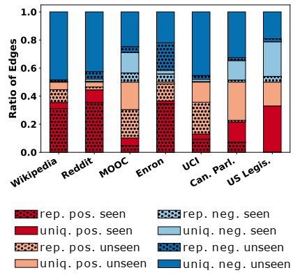  |  
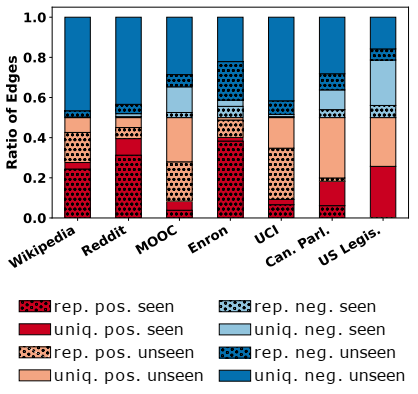
:-------------------------:|:-------------------------:	
STD – RND – transductive   |  STD – RND – inductive

**Standar Evaluation: Historical Negative Sampling.**
Similar to the *RND* setting, in the standard evaluation strategy with historical negative sampling (denoted as *HIST*), the test set composes of equal number of positive and negative edges.
However, the negative edges are sampled from the set of edges observed during training that are not recurring during the test phase.
Considering how the negative edges are sampled in HIST setting, this approach cannot be employed for performance evaluation in inductive dynamic link prediction.
For the transductive dynamic link prediction, the distribution of different types of edges is illustrated in the following figure.

| 
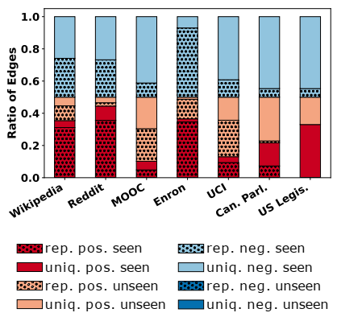 |
:-------------------------:|
STD – HIST – transductive

<!-- | 
 | **NA**
:-------------------------:|:-------------------------:	
STD – HIST – transductive  | STD – HIST – inductive -->

**EXHaustive Evaluation.**
The test set distributions in terms of different types of edges when exhaustively evaluating the dynamic link prediction task are presented in the following figures.
|
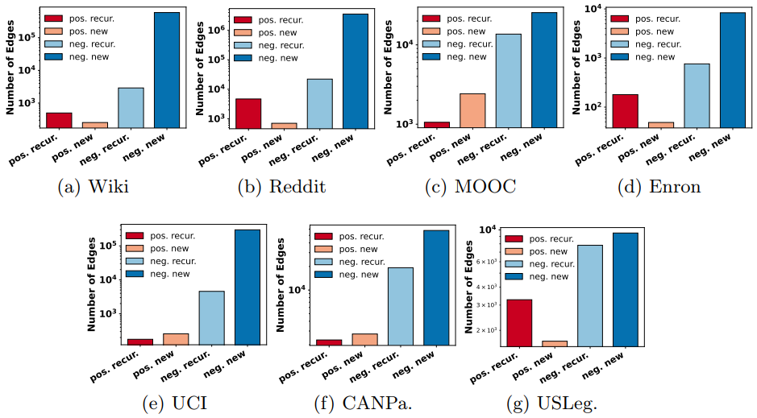 |
:-------------------------:|
Test set distributions when EXHaustive evaluation strategy is used for the *transductive* dynamic link prediction task.

|
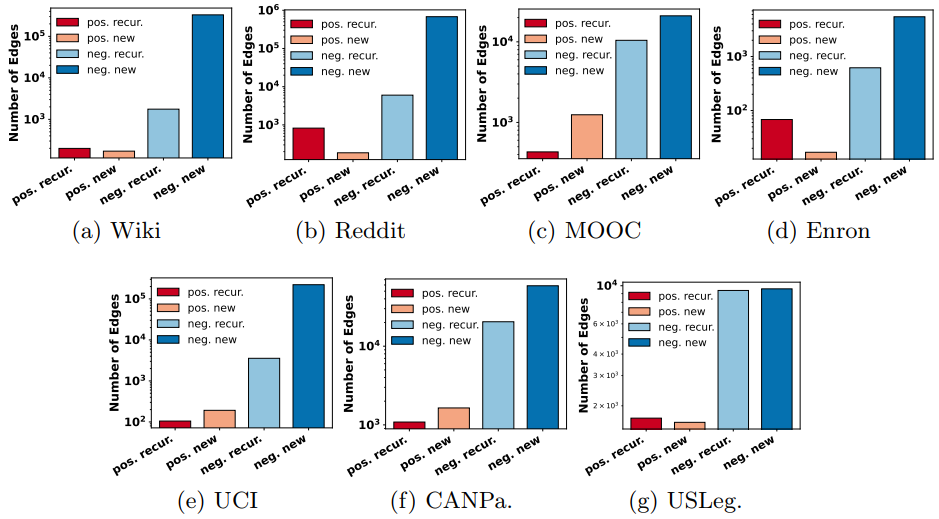 |
:-------------------------:|
Test set distributions when EXHaustive evaluation strategy is used for the *inductive* dynamic link prediction task.

### Supplemental Results
Here, we report the extended results used to plot the figures in the main paper.
In particular, we have two different setting for dynamic link prediction: *transductive* and *inductive*.
We have also two different evaluation strategies for dynamic link prediction: *standard* where an equal number of negative and positive edges are considered to evaluate the performance of the models, and EXHaustive strategy where each positive edges is evaluated against all relevant negative edges at specific intervals.
It should be noted that in the standard setting, the negative edges can be sampled according to either *random* or *historical* negative sampling approach.
We report two different performance metrics namely *Area Under the ROC Curve (AUC)* and *Average Precision (AP)*.
The results include the details of the performance of models for all links (every edges observed at the test phase), Seen links (test edges that have been observed during the previous timestamps), and Unseen links (edges that have not been observed before).
The exact numbers used for the generation of these visualizations are presented in the corresponding following tables.

**Transductive Dynamic Link Prediction**

The results of transductive dynamic link prediction for each of the dataset considered in this work in terms of AUC and AP are presented in the following figures.

|
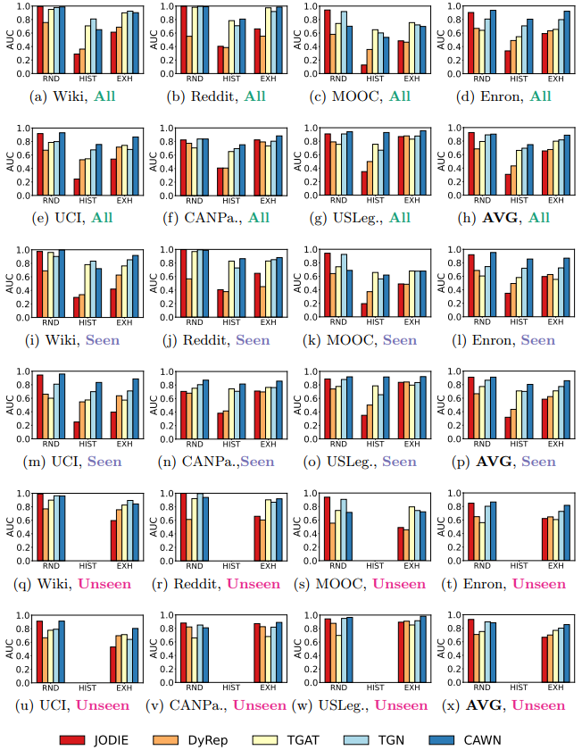 |
:-------------------------:|
Results of ***transductive*** dynamic link prediction with different evaluation strategies in terms of ***AUC***. The evaluation strategies are *RND*: standard evaluation with random negative sampling, *HIST*: standard evaluation with historical negative sampling, and *EXH*: EXHaustive evaluation strategy.

|
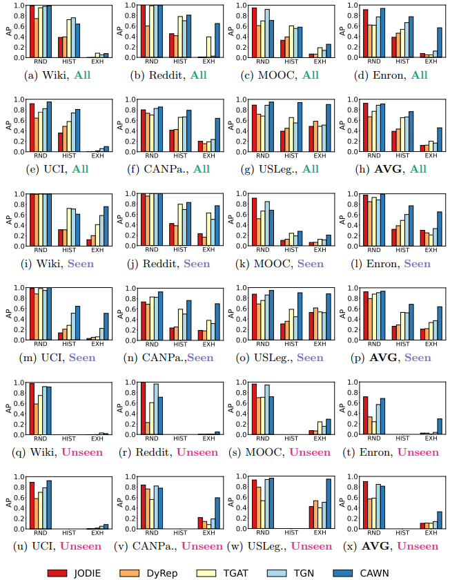 |
:-------------------------:|
Results of ***transductive*** dynamic link prediction with different evaluation strategies in terms of ***AP***. The evaluation strategies are *RND*: standard evaluation with random negative sampling, *HIST*: standard evaluation with historical negative sampling, and *EXH*: EXHaustive evaluation strategy.

**Inductive Dynamic Link Prediction**

Here, we present the results of the inductive dynamic link prediction task.
In line with previous studies (e.g., [TGAT](https://github.com/StatsDLMathsRecomSys/Inductive-representation-learning-on-temporal-graphs), [TGN](https://github.com/twitter-research/tgn), and [CAWN](https://github.com/snap-stanford/CAW)), to generate the test edges for this task, we consider a specific portion of the nodes (e.g., *10%*), and put aside these nodes as well as all edges involving these nodes.
Therefore, these nodes are not seen during the training of the models.
while the EXHaustive evaluation assesses all relevant edges, in the standard evaluation of inductive setting, the negative edges are selected only from the set of nodes that are available during the test phase. 
Thus, the standard evaluation with the historical negative sampling (i.e., HIST) is not applicable for the inductive dynamic link prediction.
The results in terms of AUC and AP are illustrated in the following figures.
The performance of the models for the inductive dynamic link prediction is generally lower than the transductive dynamic link prediction.
This agrees to the fact that making prediction for unobserved nodes is a presumably a harder task.

|
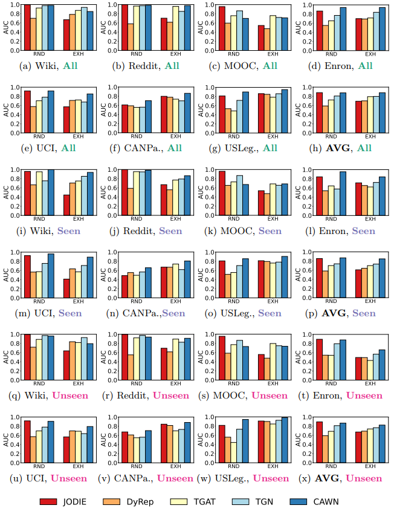 |
:-------------------------:|
Results of ***inductive*** dynamic link prediction with different evaluation strategies in terms of ***AUC***. The evaluation strategies are *RND*: standard evaluation with random negative sampling, *HIST*: standard evaluation with historical negative sampling, and *EXH*: EXHaustive evaluation strategy.

|
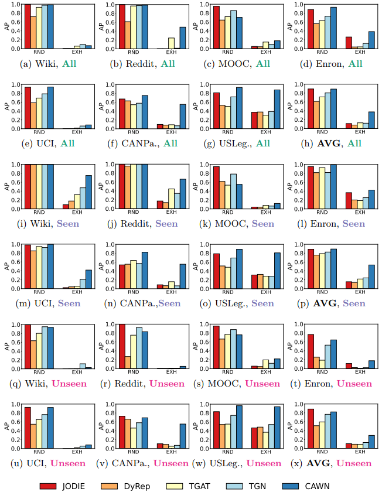 |
:-------------------------:|
Results of ***inductive*** dynamic link prediction with different evaluation strategies in terms of ***AP***. The evaluation strategies are *RND*: standard evaluation with random negative sampling, *HIST*: standard evaluation with historical negative sampling, and *EXH*: EXHaustive evaluation strategy.

The exact numbers used for the generation of above visualizations are presented in the following tables.

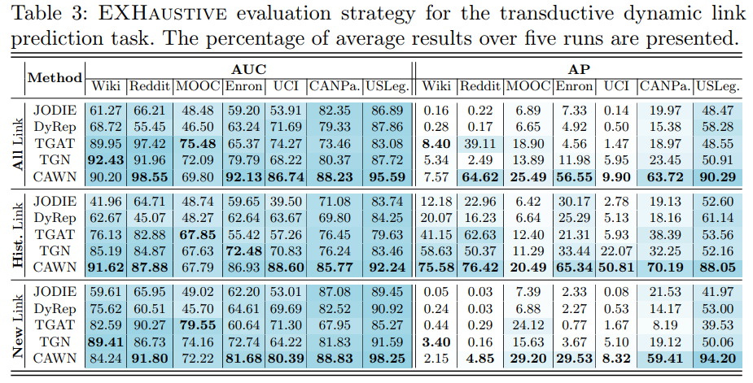

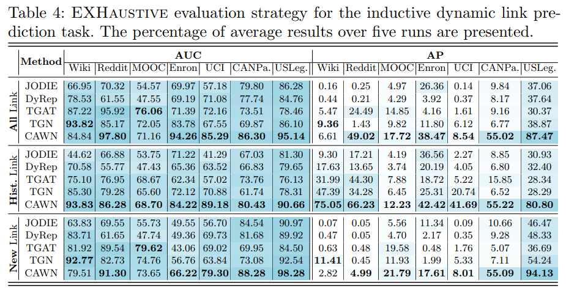

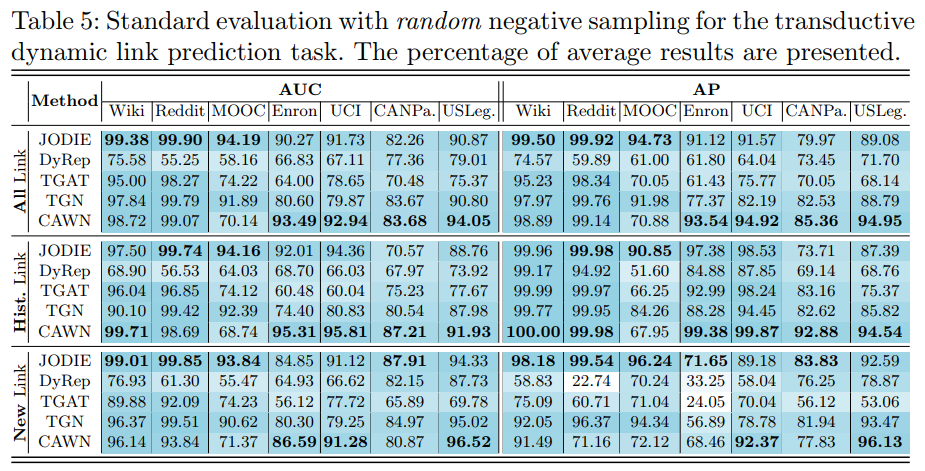

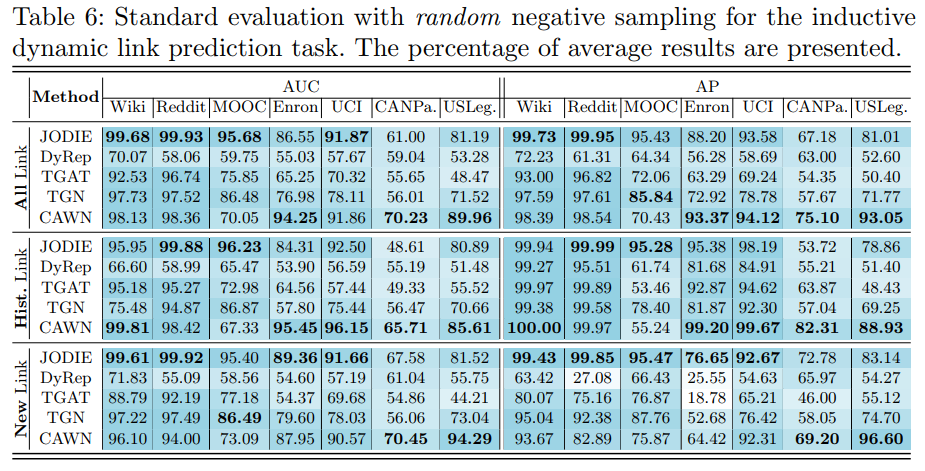

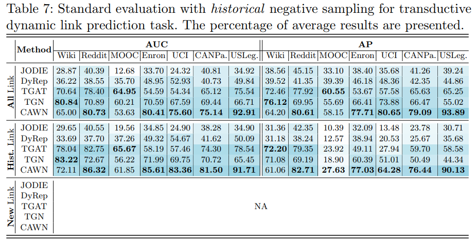

--------------------
### Acknowledgement
We would like to thank the authors of [TGAT](https://github.com/StatsDLMathsRecomSys/Inductive-representation-learning-on-temporal-graphs), [TGN](https://github.com/twitter-research/tgn), [CAWN](https://github.com/snap-stanford/CAW), and [EdgeBank](https://github.com/fpour/DGB/tree/main) for providing open access to their projects.

